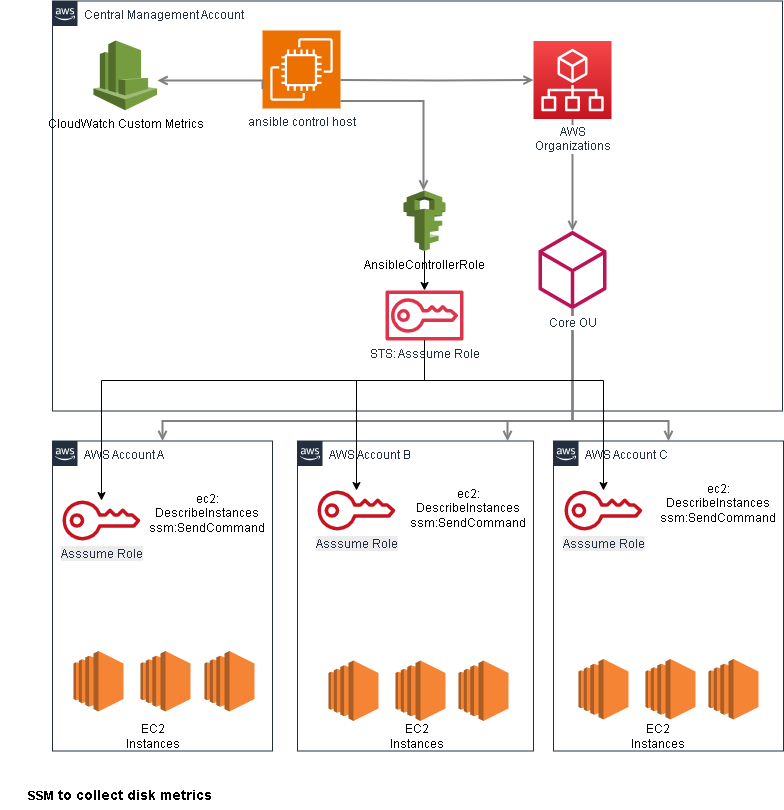

# AWS Multi-Account Disk Utilization Monitoring

[](https://opensource.org/licenses/MIT)
[](https://www.python.org/downloads/)
[](https://www.ansible.com/)

## Overview

This repository provides a resilient, secure, and scalable solution to monitor disk utilization across multiple AWS accounts using Ansible. It leverages AWS Organizations for centralized account management, cross-account IAM roles for secure access, and stores aggregated metrics in S3 for visualization.



## Quick Start

### Prerequisites
- AWS CLI configured with appropriate permissions
- Ansible 2.12+ installed
- Python 3.8+ with boto3
- ansible control host configured in the management account

## 🌟 Features

- **Multi-Account Support**: Monitor disk utilization across multiple AWS accounts
- **Real-time Monitoring**: CloudWatch dashboards for instant visibility
- **Automated Alerts**: CloudWatch alarms with SNS notifications
- **Custom Metrics**: Detailed disk usage and available space tracking
- **Scalable Architecture**: Easy to add new accounts and instances
- **Security First**: Secure credential management and minimal IAM permissions

## 📋 Prerequisites

- Ansible 2.9 or higher
- Python 3.x
- AWS CLI
- SSH access to EC2 instances
- AWS credentials with appropriate permissions [(detailed Guide)](./docs/manual-setup-guide.md)

## 🔧 Installation

1. Clone the repository:
```bash
git clone https://github.com/your-org/aws-ec2-disk-utilization-across-multi-account.git
cd aws-ec2-disk-utilization-across-multi-account
```

2. Install required Python packages:
```bash
pip install boto3 jinja2
```

3. Set up environment variables for AWS credentials:
```bash
# Account 1
export AWS_ACCOUNT_1_ID="your-account-1-id"
export AWS_ACCOUNT_1_ACCESS_KEY="your-access-key-1"
export AWS_ACCOUNT_1_SECRET_KEY="your-secret-key-1"

# Account 2
export AWS_ACCOUNT_2_ID="your-account-2-id"
export AWS_ACCOUNT_2_ACCESS_KEY="your-access-key-2"
export AWS_ACCOUNT_2_SECRET_KEY="your-secret-key-2"

# Account 3
export AWS_ACCOUNT_3_ID="your-account-3-id"
export AWS_ACCOUNT_3_ACCESS_KEY="your-access-key-3"
export AWS_ACCOUNT_3_SECRET_KEY="your-secret-key-3"
```

## 🚀 Usage

1. Set up CloudWatch monitoring infrastructure:
```bash
python3 scripts/setup_monitoring.py
```

2. Run the disk utilization playbook:
```bash
ansible-playbook -i ansible/inventory/aws_accounts.yml ansible/playbooks/disk_utilization.yml
```

## 📊 Monitoring

The solution provides:

### CloudWatch Dashboards
- Real-time disk utilization metrics
- Per-instance and aggregated views
- Historical data visualization
- Customizable time ranges

### CloudWatch Alarms
- High disk usage alerts (>80%)
- Low available space alerts (<10GB)
- SNS notifications for critical events
- Configurable thresholds

## 🔐 Security Considerations and Best Practices

### Credential Management
- Use AWS Secrets Manager or Parameter Store instead of environment variables
- Implement automatic credential rotation
- Use AWS Systems Manager Session Manager instead of direct SSH
- Implement AWS KMS for encryption at rest

### IAM Security
- Implement resource-level permissions instead of "*"
- Use AWS Organizations for centralized policy management
- Add service control policies (SCPs) at organization level
- Implement IP restrictions for API access
- Use AWS Config for compliance monitoring

### Access Control
- Implement least privilege principle
- Use AWS Organizations for account management
- Enable AWS CloudTrail for audit logging
- Implement AWS WAF for API protection
- Regular security assessments and audits

## 📈 Scalability Considerations and Best Practices

### Architecture
- Use AWS Organizations for centralized account management
- Implement AWS Control Tower for governance
- Deploy Ansible control host with auto-scaling
- Use AWS Systems Manager for automation
- Implement metric aggregation at source

### Performance
- Use CloudWatch Contributor Insights
- Implement caching for frequently accessed data
- Use metric math for efficient aggregation
- Set up proper retention policies
- Implement parallel processing where possible


## 🛡️ Resiliency Considerations and Best Practices

### High Availability
- Deploy Ansible control host across multiple AZs
- Implement retry mechanisms for failed operations
- Use circuit breakers for API calls
- Implement proper error handling
- Use AWS Systems Manager for automation

### Disaster Recovery
- Implement backup of Ansible configurations
- Set up cross-region metric replication
- Create recovery playbooks
- Implement automated testing
- Regular disaster recovery drills

### Monitoring and Alerting
- Set up CloudWatch dashboards for solution health
- Implement synthetic monitoring
- Add custom metrics for solution performance
- Set up proper alerting thresholds
- Regular performance testing

## 🛠️ Adding New AWS Accounts

1. Add account details to `ansible/inventory/aws_accounts.yml`:
```yaml
account_4:
  vars:
    aws_account_id: "{{ lookup('env', 'AWS_ACCOUNT_4_ID') }}"
    aws_access_key: "{{ lookup('env', 'AWS_ACCOUNT_4_ACCESS_KEY') }}"
    aws_secret_key: "{{ lookup('env', 'AWS_ACCOUNT_4_SECRET_KEY') }}"
```

2. Set corresponding environment variables
3. Run the monitoring setup script


## 🤝 Contributing

1. Fork the repository
2. Create your feature branch (`git checkout -b feature/AmazingFeature`)
3. Commit your changes (`git commit -m 'Add some AmazingFeature'`)
4. Push to the branch (`git push origin feature/AmazingFeature`)
5. Open a Pull Request
